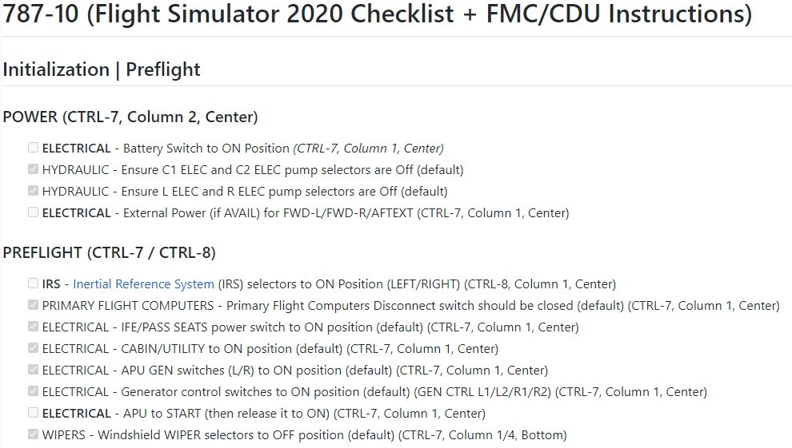

# Cold And Dark
I am not a private or commerical pilot, I am a Microsoft Flight Simulator enthusiast and I've been trying to immerse myself in increasing amounts of realism in the game.

I've added a number of Add-Ons to bring greater levels of realism including:
* Pilot2Atc **(PURCHASED)** - A fantastic stand-alone ATC system that is in my mind quite a bit superior to the current Microsoft implementation
* Chatter files **(PURCHASED)** -- I've enhanced Pilot2Atc buy purchasing "Chatter"files which are real-world ATC recordings that are played back in the background to add to the realism
* OnAir **(PURCHASED)** - if flying randomly from place to place is not enought to sustain your interest, this add-on will essentially turn your flying into a business.  You can purchase aircraft, hire pilots, and fly cargo and passengers to earn money.  You can also purchase fuel and maintenance services.  It's a great way to add a bit of purpose to your flying.
* FlyByWire FSLTL-Traffic Injector **(FREE)** - this is a great add-on that will inject real-world traffic into your game
* Navigraph Charts **(SUBSCRIPTION)** - this service provides access to real-world charts for airports all around the world as well as access to a number of services and applications.  I find that it's worth the investment.
* Pushback Helper **(FREE)** - this is a great add-on that will allow you to control your pushback with a bit more precision than the default pushback system

What you will find here represents data I've collected from a variety of sources.
- It was inspired initially by simply following Microsoft Flight Simulator 2020's built-in CheckList for the 787-10
- I layered into it guidance from a number of content providers online to enhance this by adding FMC, and to a minor extent ATC
- Shout outs to the following content providers:
    - [P Gatcomb](https://www.youtube.com/@PGatcomb) - Great videos on the 787-10, instructional FMC information, and as he is obviously a commerical pilot, real world tips-n-tricks
    - [OverKillSimulations](https://www.youtube.com/@OverkillSimulations) - He provides fantastic free content, and also some amazing guides.  Nothing I am showing here is directly from his guides which are available via his Patreon channel, but I will likely incorporate some of his great guidance from his abundant video collection.

It's interesting how many variations there are of starting an aircraft when it's "Cold and Dark".  What I've captured may make no sense at all to you, it may represent things out of order, and it may be factually untrue.  I invite you to provide me with feedback so that hopefully these issues can be addressed and allow these documents to become reference materials that others can benefit from as well.

GrayWinst

Here is an example of some guidance I'm trying to bring together:

## Example Guidance
This guidance snippet below shows some of the current style I'm trying to use in representing this guidance.  I am trying to provide an actual "checklist" that you could follow in order to transition from "Cold and Dark", all the way through landing and going "Dark" again.  Some of the items listed are in **BOLD** and they have a [ ] checkmark that is not already checked.  In contrast, the other items are not bolded and they have a populated checkmark.  What I'm trying to represent here is that many of the defaults are already set to the position in the checklist and as a result there is no action to take (the [x] Checkmark is already populated.  The other items need your action.  Finally, I wanted to keep the full checklist because in the "real" world you would not assume that everything is set one way or another and you would be forced to check.  You can use this as a "complete" checklist if you want, or just skip to the items that require your attention.

I hope you find these helpful and I invite feedback on improvements.

